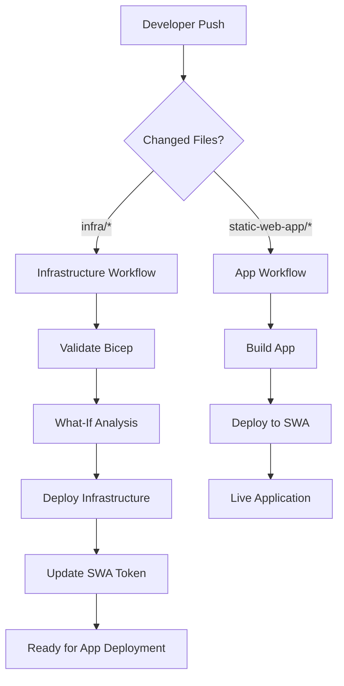

# Infrastructure as Code with Bicep and GitHub Actions

This directory contains the Azure infrastructure setup using Bicep templates, deployed via GitHub Actions with federated identity authentication.

## 🏗️ Architecture

The infrastructure deploys:
- **Resource Group**: `rg-kennethheine-prod`
- **Azure Static Web App**: For hosting the static website
- **GitHub Integration**: Automated deployments from the repository

## 📁 Directory Structure

```
infra/
├── main.bicep                    # Main orchestration template (subscription scope)
├── bicepconfig.json             # Bicep linting configuration
├── modules/                     # Reusable Bicep modules
│   └── static-web-app.bicep    # Static Web App module
└── parameters/                  # Environment-specific parameters
    └── production.bicepparam    # Production parameters
```

## 🔐 Authentication

The deployment uses **Azure AD Federated Identity** (OIDC) instead of secrets:

- ✅ **Secure**: No long-lived secrets stored in GitHub
- ✅ **Scoped**: Limited to specific repository and environment
- ✅ **Auditable**: All deployments are logged and traceable

### Required GitHub Secrets

These are set up by the PowerShell scripts in the `scripts/` directory:

- `AZURE_CLIENT_ID`: App registration client ID
- `AZURE_TENANT_ID`: Azure AD tenant ID  
- `AZURE_SUBSCRIPTION_ID`: Target subscription ID

## 🚀 Deployment Workflows

### 1. Infrastructure Deployment (`.github/workflows/deploy-infrastructure.yml`)

**Triggers:**
- Push to `main` branch with changes in `infra/` directory
- Pull requests with changes in `infra/` directory
- Manual dispatch

**Steps:**
1. **Validate**: Bicep template validation and What-If analysis
2. **Deploy**: Deploy infrastructure to Azure
3. **Configure**: Automatically update Static Web App deployment token
4. **Summary**: Provide deployment summary with links

### 2. Static Web App Deployment (`.github/workflows/deploy-app.yml`)

**Triggers:**
- Push to `main` branch with changes in `static-web-app/` directory
- Pull requests with changes in `static-web-app/` directory
- Manual dispatch

**Steps:**
1. **Build**: Install dependencies and build the application
2. **Deploy**: Deploy to Azure Static Web Apps
3. **PR Cleanup**: Clean up staging environments when PRs are closed

## 🔧 Usage

### Initial Setup

1. **Run the setup scripts** (one-time setup):
   ```powershell
   cd scripts
   .\1-create-resource-group.ps1
   .\2-create-app-registration.ps1
   .\3-setup-github-secrets.ps1
   ```

2. **Deploy infrastructure** (push changes to trigger):
   ```bash
   git add infra/
   git commit -m "Add initial infrastructure"
   git push origin main
   ```

3. **Deploy the app** (push changes to trigger):
   ```bash
   git add static-web-app/
   git commit -m "Update static web app"
   git push origin main
   ```

### Making Changes

#### Infrastructure Changes
- Modify files in `infra/` directory
- Push to `main` or create a PR to see What-If analysis
- Infrastructure changes automatically update the deployment token

#### Application Changes  
- Modify files in `static-web-app/` directory
- Push to `main` or create a PR to see staging deployment
- Changes are automatically deployed to production

### Manual Deployment

You can manually trigger deployments from the GitHub Actions tab:
- **Deploy Infrastructure**: For infrastructure changes
- **Deploy Static Web App**: For application deployments

## 📋 Environments

### Production Environment
- **Resource Group**: `rg-kennethheine-prod`
- **Location**: West Europe
- **Static Web App**: Auto-generated name with unique suffix
- **Domain**: Provided by Azure Static Web Apps

### Adding New Environments

1. **Create new parameter file**:
   ```bicep
   // infra/parameters/staging.bicepparam
   using '../main.bicep'
   
   param resourceGroupName = 'rg-kennethheine-staging'
   param tags = {
     environment: 'staging'
     // ... other tags
   }
   ```

2. **Update workflows** to support the new environment

3. **Add federated credentials** for the new environment in the app registration

## 🔍 Monitoring and Troubleshooting

### GitHub Actions Logs
- Check the **Actions** tab in your GitHub repository
- Each deployment shows detailed logs and summaries

### Azure Portal
- Monitor resources in the Azure portal
- Check Activity Logs for deployment history
- Use Application Insights (if configured) for app monitoring

### Common Issues

**"Authentication failed"**
- Verify federated identity credentials are correctly configured
- Check that GitHub secrets are set correctly
- Ensure the app registration has proper permissions

**"Resource already exists"**
- Bicep deployments are idempotent - this is usually fine
- Check the What-If analysis to see actual changes

**"Static Web App deployment failed"**
- Verify the `AZURE_STATIC_WEB_APPS_API_TOKEN` secret is set
- Check that the app location path is correct
- Ensure the build succeeds locally

## 🏷️ Resource Naming

Resources use a consistent naming pattern with a unique suffix:
- Resource Group: `rg-kennethheine-prod`
- Static Web App: `swa-kennethheine-com-{unique-suffix}`

The unique suffix ensures no naming conflicts across deployments.

## 🔄 CI/CD Pipeline Flow



This setup provides a complete Infrastructure as Code solution with secure, automated deployments using modern DevOps practices.
